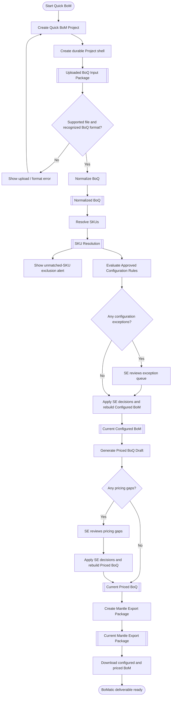

# Praxis Application Flow Blueprints

**Status:** Approved target flow and implementation authority
**Locked:** 2026-08-07
**Implementation handbook updated:** 2026-08-09
**Program:** Praxis Workflow Modernization
**Product:** Praxis
**Quick BoM feature:** BoMatic
**Document role:** Canonical flow, modernization story ledger, and implementation handbook
**Implementation status:** Target architecture; current code does not yet implement this flow end to end
**Ledger status:** Stories `PWM-00` through `PWM-19` are planned and not yet verified

## 1. Purpose And Authority

This document is the implementation authority for modernizing the two Praxis application functions:

1. **BoMatic Quick BoM**: upload, normalize, resolve, configure, price, export, and download.
2. **RFP / HLD / Technical Proposal**: ingest an RFP package, establish requirements, reuse BoMatic configuration without pricing, design an HLD with AI assistance, build the compliance matrix, generate the full technical proposal, obtain SE authority, and download it.

The flowcharts are product blueprints. Code, stages, routes, UI controls, artifacts, processing jobs, tests, and staleness rules must be rebuilt around them. Existing behavior is not a reason to restore a removed approval or gate.

The completed Miro diagrams are visual references. This document includes all decisions made after the exported images were reviewed. Where an image label conflicts with this document, this document controls.

The following older documents are explicitly excluded as target-flow authority:

- `BOMATIC_HLD_AGENTIC_AUTHORITY_CHAIN_ROADMAP.md`
- `BOMATIC_HLD_DISCUSSION_DECISIONS_AND_LESSONS.md`
- `HONEYWELL_HLD_PROJECT_EVIDENCE_NOTES.md`

They must not be used to reintroduce AI quality gates, provider review loops, manual draw.io authority paths, compliance-before-HLD ordering, pricing in the RFP chain, or old approval-heavy stages.

`PRAXIS_CURRENT_STATE.md` and current code describe implementation history and migration gaps only. They do not override this target.

### 1.1 How To Use This Handbook

- **Owner/Product Owner:** Use Sections 2-17 to confirm product behavior and authority; use Sections 19-21 to monitor delivery, resolve hard stops, approve legacy deletion, and eventually approve production release.
- **Sales/System Engineer:** Use the Quick BoM and RFP/HLD/TP flow sections to verify that reviews occur only where engineering judgment adds value and that generated customer-facing artifacts retain correct technical authority.
- **Codex guardian:** Treat the story ledger, detailed story contracts, gates, anomaly protocol, and checklists as the controlling execution plan. Inspect current code before setting each story's exact file allowlist.
- **Claude builder:** Implement only the active story and its prompt allowlist. The builder may not reinterpret the product flow, alter this handbook, weaken a gate, or expand authority.

For human readers, the flow and risk sections explain what Praxis will do and why. For implementation agents, Section 19 explains how to change the current application without a big-bang rewrite or permanent legacy compatibility layer.

## 2. Canonical Product Shape

Praxis remains Project-centered, but approvals are no longer the spine of every operation.

```text
Project
-> immutable source files
-> versioned artifacts
-> deterministic processing or bounded AI candidate drafting
-> exception-focused SE decisions and required finalizations
-> current deliverable
-> audited download
```

A durable processing ledger and its user-safe status events run alongside the artifact chain:

```text
Project operation
-> queued
-> running
-> completed | completed_with_findings | waiting_for_user | action_required
-> next eligible operation
```

The ledger informs the user and records processing truth. It does not become another approval system, job-orchestration platform, or source of product authority.

### 2.1 Non-Negotiable Principles

- Deterministic clean paths progress automatically.
- User intervention occurs only for invalid source input, actionable configuration or pricing exceptions, and the specific RFP artifacts that require SE judgment.
- There are no routine Quick BoM SKU, configuration, pricing, export, or final-summary approvals.
- Candidate-quality findings do not create automated retry loops or block progression. Findings travel with the candidate to the existing SE review.
- Infrastructure errors must never produce an endless spinner. They return a visible recoverable state and preserve the last current artifact.
- Original customer uploads are immutable source evidence. Replacements create new `project_file` versions.
- Every derived artifact records exact source file and artifact IDs and versions.
- Upstream changes stale only their actual downstream dependants.
- A stale customer-facing artifact cannot be downloaded.
- Human/SE decisions remain final authority for customer-facing requirements, HLD, compliance, and technical proposal content.
- Runtime AI is candidate drafting assistance. It is not a pricing, SKU, catalog, configuration, validation, approval, or final design authority.
- No output may claim Praxis, BoMatic, AI, Cisco, a CVD, a vendor, or a customer has certified or approved the design unless a separate real authority explicitly supports that exact claim.

## 3. Roles And System Boundaries

| Lane or boundary | Responsibility | Explicitly not responsible for |
|---|---|---|
| **Sales Engineer / Systems Engineer / User** | Supplies source material, resolves defined exceptions, confirms design inputs, reviews customer-facing candidate artifacts, and performs release/download actions. | Repeating deterministic checks or approving every intermediate artifact. |
| **Praxis** | Persists Projects/files/artifacts, runs deterministic extraction/configuration/pricing, compiles structured AI output, records findings, renders files, enforces provenance/staleness, and records user decisions. | Inventing architecture, interpreting vendor guidance as design authority, or silently changing configured SKUs. |
| **AI Advisor / Drafting Agent** | Reconciles evidence, drafts requirements, drafts HLD questions/model/diagram specification, drafts compliance responses, and drafts proposal narrative from bounded context. | Catalog lookup, SKU resolution/replacement, configuration decisions, pricing, validation authority, or final approval. |
| **Project Artifacts** | Immutable/versioned records of source lineage, candidates, approved decisions, and deliverables. | Hidden mutable workflow state. |
| **Product catalog and pricing authority** | Exact SKU resolution, approved configuration rule inputs, and deterministic pricing inputs. | HLD or proposal prose generation. |
| **LLM Wiki** | Governed advisory design knowledge and historical examples used directly by approved AI drafting stages. | Product catalog resolution, pricing, BoM mutation, or final design authority. |

The product catalog/pricing authority and LLM Wiki are separate databases with separate permissions, data models, and runtime responsibilities.

## 4. Project Processing Status Box

Both functions require a persistent **Project Processing Status** box because many operations run without user input.

### 4.1 UI Contract

The status box must be visible in the Project workspace whenever work is queued, running, waiting for the user, or has completed with findings. It should be compact and non-modal.

It displays:

- current operation name in plain language;
- current sub-step or completed-step count when the total is known;
- state: `Queued`, `Processing`, `Completed`, `Completed with findings`, `Waiting for you`, `Retrying`, or `Action required`;
- start time, last update time, and elapsed time;
- warning/finding count without exposing sensitive content;
- the output artifact and version when one is created;
- the next user action, with a direct link to the relevant exception or review surface;
- additional active operations when RFP evidence processing and configuration-only BoM processing run in parallel.

Do not show a fabricated percentage for AI or variable-duration work. Use named steps or an indeterminate progress indicator.

### 4.2 Durable Processing Contract

Processing status must survive page refresh and reconnect. Version 1 is a ledger over the existing execution model, not a new scheduler or worker platform. A processing-run record needs at least:

```text
runId
projectId
tenantId
workflow: quick_bom | rfp
flowContractVersion
operationId
displayLabel
state
exact source file/artifact IDs and versions
output artifact IDs and versions, when created
createdAt, startedAt, heartbeatAt, updatedAt, completedAt
initiatedBy
publicMessage
actionReason and actionTarget, when required
userRetryAllowed
supersededAt, when applicable
supersededByRunId, when applicable
```

`flowContractVersion` is distinct from `workflow`. `workflow` identifies the product mode; `flowContractVersion` identifies the immutable governing workflow and artifact-semantics contract. It is set when the Project is created and stamped onto every processing run and artifact. Any breaking workflow or artifact-payload semantic change requires a new contract version.

The exact input version set is mandatory. It is the basis for duplicate-run prevention, source-change supersession, stale-output rejection, reproducibility, and audit. A small append-only processing-event record may capture named state transitions and public messages; this is not an event-sourcing framework.

Version 1 explicitly excludes job priorities, worker-pool management, general scheduler abstraction, automated content-repair orchestration, fabricated progress percentages, provider-response streaming, and an event-sourcing framework. `findingCount` may be added later if it is useful, but it is not required for correctness.

Provider prompts, hidden reasoning, raw provider responses, credentials, customer document text, and stack traces must never appear in the user-facing status payload.

### 4.3 Progression And Failure Rules

- One active run is allowed for the same operation and exact source version set. Duplicate clicks return the active run.
- A source change supersedes work running against the old source version.
- Operations are idempotent. Repeating an operation against the same inputs must not create uncontrolled duplicate candidates.
- Candidate schema or quality findings produce `completed_with_findings`; they do not trigger an automated AI repair loop.
- Defined business exceptions produce `waiting_for_user` and link to the exact affected rows/items.
- Transient infrastructure failures may receive one bounded technical retry where the operation is safe and idempotent. There is no automated content/design retry. If recovery is not possible, show `action_required` with a safe user-triggered retry action. Never leave an indefinite `processing` state.
- Worker heartbeats plus timeout reconciliation through the existing execution path, status reads, or subsequent run requests must transition abandoned work to `action_required`; a new scheduling platform is not required.
- A retry resumes from the latest current upstream artifacts. It does not discard or overwrite an approved artifact.
- Technical errors do not authorize the system to fabricate an output or advance with no artifact.

### 4.4 Required Status Messages

Quick BoM examples:

```text
Validating the uploaded BoQ
Normalizing BoQ lines
Resolving SKUs against catalog version <version>
5 unmatched SKUs excluded; continuing
Evaluating approved configuration rules
Waiting for 2 configuration decisions
Calculating SAR pricing and VAT
Waiting for 1 pricing correction
Building the Mantle workbook
Customer-ready workbook available
```

RFP examples:

```text
Storing original source files
Extracting source-linked text and tables
Reconciling and deduplicating evidence
Drafting the requirements baseline
Waiting for requirements review
Configuring the current BoQ without pricing
Preparing HLD intake questions
Waiting for HLD intake answers
Drafting the HLD design model
Rendering the HLD diagram
Waiting for HLD review
Drafting the compliance matrix
Waiting for compliance review
Drafting the technical proposal
Rendering DOCX and PDF outputs
Waiting for technical proposal review
Technical proposal ready for download
```

## 5. BoMatic Quick BoM

### 5.1 Purpose

Quick BoM converts a supported customer BoQ/BoM into a configured, deterministically priced, customer-ready Mantle workbook. It is catalog-agnostic in product design, but each runtime deployment still requires approved catalog, configuration-rule, and pricing authority data.

### 5.2 Target Flow Diagram



### 5.3 Step Contracts

| Step | Lane | Canonical box | Required behavior and reason |
|---:|---|---|---|
| Q1 | User | **Create Quick BoM Project** | Capture customer name, Project name, `.xlsx`/`.csv` upload, pricing mode (`margin` or `markup`), rate percentage, VAT percentage, and SAR currency settings at creation. Capturing pricing inputs here avoids a later setup gate. |
| Q2 | Praxis | **Create durable Project shell** | Persist the Project, create immutable `project_file` records, and attach the uploaded file. A replacement is a new source version, never an overwrite. |
| A1 | Artifact | **Uploaded BoQ Input Package** | `input_package`; references the current `project_file` ID/version and user-confirmed role. It contains no copied workbook. |
| Q3 | Praxis decision | **Supported file and recognized BoQ format?** | Validate extension, required columns, data types required for normalization, and one of the supported locked layouts. Store-first is intentional: source bytes and attempted versions remain auditable. |
| Q4 | Praxis/User | **Show upload / format error** | Identify the file and correctable reason. The user replaces the source file. This is a real blocking input error, not an approval. |
| Q5 | Praxis | **Normalize BoQ** | Deterministically convert accepted rows into the canonical line model while retaining source sheet/row/cell references and source order. |
| A2 | Artifact | **Normalized BoQ** | `normalized_boq`; usable only when current, valid, and derived from the current input package. |
| Q6 | Praxis | **Resolve SKUs** | Match against the current approved product catalog. Accept only unique active exact matches. Missing, ambiguous, normalized-only, fuzzy, or non-exact matches are unmatched for the prototype. Do not substitute. |
| A3 | Artifact | **SKU Resolution** | `sku_resolution`; records every source line, match state, method, catalog version, recognized target, and downstream exclusion state. |
| Q7 | Notification | **Unmatched-SKU exclusion alert** | Show a subtle nonblocking message such as `5 SKUs are not in the catalog and will be excluded`, with a small detail view listing source line, entered SKU, and description. Processing continues. |
| Q8 | Praxis | **Evaluate Approved Configuration Rules** | Run the current approved structured rule pack on recognized SKUs only. Add deterministic required/default lines and collect only real options, conflicts, waivers, and coverage gaps. Runtime AI is not used. |
| Q9 | Praxis decision | **Any configuration exceptions?** | `No` proceeds automatically. `Yes` opens only the affected exception items. Deterministic lines never require routine review. |
| Q10 | User | **SE reviews exception queue** | Allowed actions are limited to approved choices: select among rule-provided options, include/exclude an optional line, waive a required/default line with reason, or mark an item out of scope where policy allows. No invented SKU or silent substitution. |
| Q11 | Praxis | **Apply SE decisions and rebuild Configured BoM** | Apply recorded decisions to deterministic rule output and create a new version. When there were no exceptions, create the clean version directly. |
| A4 | Artifact | **Current Configured BoM** | `configuration_expansion`; recognized configured lines only, parent-child structure, source/rule provenance, exclusion metadata, and any SE exception-decision provenance. It is current, not routinely `needs_review`. |
| Q12 | Praxis | **Generate Priced BoQ Draft** | Use recognized configured lines only. Apply approved catalog prices, selected margin/markup, VAT, SAR rounding, and totals deterministically. AI never performs pricing or arithmetic. |
| Q13 | Praxis decision | **Any pricing gaps?** | Detect missing/stale prices, invalid or unexpected zero prices, invalid quantities, unsupported pass-through states, exclusions, and pricing-policy conflicts. |
| Q14 | User | **SE reviews pricing gaps** | Supported actions: exclude an out-of-scope line, mark an allowed unpriced/pass-through line, or correct a quantity/source issue through a traceable edit or re-upload. Do not invent a catalog price. |
| Q15 | Praxis | **Apply SE decisions and rebuild Priced BoQ** | Persist the decision provenance and recalculate the complete priced artifact deterministically. |
| Q16 | Artifact | **Current Priced BoQ** | `priced_boq`; current and usable when no actionable pricing gap remains. The clean target has no routine `needs_review` or approval state. |
| Q17 | Praxis | **Create Mantle Export Package** | Generate the workbook from the latest current priced BoQ. Internal checks verify template structure, required sheets, totals, and file integrity. These checks are implementation safeguards, not a user gate. |
| A5 | Artifact | **Current Mantle Export Package** | `export_package`; records source priced-BoQ version, template version, generator version, and file integrity metadata. It is downloadable only while current. |
| Q18 | User | **Download configured and priced BoM** | Download the customer-ready Mantle workbook. Record the user, time, and exact export artifact/version as the release event. |

### 5.4 Quick BoM Artifact Chain

```text
project_file
-> input_package
-> normalized_boq
-> sku_resolution
-> configuration_expansion
-> priced_boq
-> export_package
```

### 5.5 Quick BoM Intervention Rules

| Condition | User action | Blocking? |
|---|---|---:|
| Unsupported file or invalid locked layout | Replace source file | Yes |
| Unmatched/non-exact SKU | Optional detail inspection; line is excluded | No |
| Rule-provided choice, conflict, waiver, or coverage gap | Decide only affected item | Yes |
| Missing/stale/invalid price or pricing-policy gap | Classify or correct only affected item | Yes |
| Clean configuration and pricing | None | No |
| Current export available | Download | No additional approval |

### 5.6 Quick BoM Staleness

- New BoQ upload stales all downstream Quick BoM artifacts.
- Catalog-version or SKU-exclusion changes stale configuration, pricing, and export.
- Rule-pack or configuration-decision changes stale configuration, pricing, and export.
- Pricing settings, pricing authority, pass-through classification, exclusion, or quantity changes stale pricing and export.
- Export-template or generator changes do not silently replace an already released file. They create a new export version when regenerated.
- A stale export is hidden from the download action.

## 6. RFP / HLD / Technical Proposal Chain

### 6.1 Purpose And Ordering

The RFP chain creates a full technical proposal from controlled customer evidence and an unpriced configured BoM.

The locked order is:

```text
RFP evidence
-> Approved Requirements Baseline
+ Current Configured BoM from the shared BoMatic configuration-only path
-> Confirmed HLD Intake
-> Approved HLD Design Model with accepted diagram
-> Approved Compliance Matrix
-> Final Technical Proposal
```

Configuration happens early and may run in parallel with evidence/requirements processing. HLD needs both the approved requirements baseline and the current unpriced Configured BoM. Compliance comes after HLD because it records how the approved design responds to each approved requirement. The RFP chain does not create a priced BoM.

### 6.2 Target Flow Diagram

```mermaid
flowchart TD
    R0([Start RFP Project]) --> R1[Start RFP project and upload RFP package]
    R1 --> R2[Create durable Project shell]
    R2 --> R3[Store Original Files]
    R3 --> RA1[[RFP Input Package]]
    RA1 --> R4[Extract text and tables; compile reviewable evidence]
    R4 --> RA2[[Extracted Evidence Result]]
    RA2 --> R5{Any blocking extraction exceptions?}
    R5 -- Yes --> R6[Resolve Unusable Source File]
    R6 --> R3
    R5 -- No --> R7[AI Evidence Clean-up]
    R7 --> RA3[[Evidence Package Draft]]
    RA3 --> R8[Draft Candidate Requirements Baseline]
    R8 --> RA4[[Candidate Requirements Baseline]]
    RA4 --> R9[Review Requirements Baseline]
    R9 --> R10[Finalize Requirements Baseline]
    R10 --> RA5[[Approved Requirements Baseline]]

    RA1 --> B1[BoMatic Configuration-Only Flow]
    B1 --> BA1[[Current Configured BoM - unpriced]]

    RA5 --> R11[Prepare HLD Intake Context]
    BA1 --> R11
    R11 --> R12[Draft HLD Clarification Questionnaire]
    W[(LLM Wiki)] -. governed iterative retrieval .-> R12
    R12 --> RA6[[Candidate HLD Intake Questionnaire]]
    RA6 --> R13{Material unanswered questions?}
    R13 -- Yes --> R14[Complete HLD Intake]
    R14 --> R15[Build Confirmed HLD Intake]
    R13 -- No --> R15
    R15 --> RA7[[Confirmed HLD Intake]]

    RA5 --> R16[Assemble HLD Drafting Context]
    BA1 --> R16
    RA7 --> R16
    R16 --> R17[Draft Candidate HLD Design Model]
    W -. governed iterative retrieval .-> R17
    R17 --> R18[Compile Candidate HLD Model and Record Findings]
    R18 --> RA8[[Candidate HLD Design Model]]
    RA8 --> R19[Compose Candidate HLD Diagram]
    W -. presentation retrieval only .-> R19
    R19 --> R20[Render HLD Diagram and Record Findings]
    R20 --> RA9[[HLD Diagram Draft]]
    RA9 --> R21[Review Candidate HLD Design]
    R21 --> R22[Apply SE Decisions and Finalize HLD Design Model]
    R22 --> RA10[[Approved HLD Design Model]]

    RA5 --> R23[Draft Candidate Compliance Matrix]
    BA1 --> R23
    RA10 --> R23
    R23 --> R24[Compile Candidate Compliance Matrix and Record Findings]
    R24 --> RA11[[Candidate Compliance Matrix]]
    RA11 --> R25[Review Candidate Compliance Matrix]
    R25 --> R26[Apply SE Decisions and Finalize Compliance Matrix]
    R26 --> RA12[[Approved Compliance Matrix]]

    RA5 --> R27[Assemble Technical Proposal Drafting Context]
    BA1 --> R27
    RA10 --> R27
    RA12 --> R27
    R27 --> R28[Draft Candidate Technical Proposal Content]
    W -. governed iterative retrieval .-> R28
    R28 --> R29[Generate Technical Proposal Candidate]
    R29 --> RA13[[Technical Proposal Candidate]]
    RA13 --> R30[Review Technical Proposal Candidate]
    R30 --> R31[Apply SE Decisions and Finalize Technical Proposal]
    R31 --> RA14[[Final Technical Proposal]]
    RA14 --> R32[Download Final Technical Proposal]
    R32 --> R33([Technical Proposal Ready for Customer Submission])
```



## 7. RFP Source And Evidence Flow

### 7.1 Source Intake

| Step | Lane | Canonical box | Required behavior and reason |
|---:|---|---|---|
| R1 | User | **Start RFP project and upload RFP package** | Require an RFP document and BoQ for this target. Accept optional SOW, compliance documents, addenda, and supporting files. The user explicitly assigns each file role from a controlled list. |
| R2 | Praxis | **Create durable Project shell** | Create the Project and immutable `project_file` records. Persist user-confirmed roles and source version metadata. |
| R3 | Praxis | **Store Original Files** | Store original bytes in tenant-isolated object storage. This occurs before semantic validation so every received source version is auditable. |
| RA1 | Artifact | **RFP Input Package** | `input_package`; references current `project_file` IDs, versions, roles, and the current BoQ source. It contains no copied files. |

### 7.2 Extraction And Reconciliation

| Step | Lane | Canonical box | Required behavior and reason |
|---:|---|---|---|
| R4 | Praxis | **Extract text and tables; compile reviewable evidence** | Deterministically extract readable text and tables from the current input package. Preserve file/page/section/table/row locators. Initial scope assumes text and tables; OCR/image interpretation is not included. |
| RA2 | Artifact | **Extracted Evidence Result** | `extraction_delta`; raw source-linked extraction output plus file/page/table references, extraction warnings, and failures. It is never requirements authority. |
| R5 | Praxis decision | **Any blocking extraction exceptions?** | Blocking only when a required source is unreadable/encrypted, extraction is empty/failed, or source locators cannot be retained. Headers, footers, repetition, and normal extraction noise are not blocking failures. |
| R6 | User | **Resolve Unusable Source File** | Show the affected file and reason. Replace a required RFP/BoQ file or explicitly exclude an optional file. Replacement creates a new source version and restarts only its dependent extraction. |
| R7 | AI | **AI Evidence Clean-up** | Reconcile extracted text/tables with the readable source at this bounded intake stage. Add only source-supported omissions; suppress repeated headers, footers, notices, signature lines, and duplicate content; group related requirements/constraints/clarifications; record each addition/suppression and source locator. Do not invent evidence. |
| RA3 | Artifact | **Evidence Package Draft** | `evidence_package`, not `extraction_delta`; source-linked deduplicated evidence, AI-added omissions, suppressed repetition records, item confidence/reason, and preserved links to raw extraction. Candidate only. |

The user does not perform a separate package-level evidence approval. Requiring an SE to reread every extracted line would reproduce the manual workload Praxis is meant to reduce. Risk is controlled through source traceability, per-item confidence, explicit AI-addition flags, and the exception-focused requirements review.

## 8. Requirements Baseline Flow

| Step | Lane | Canonical box | Required behavior and reason |
|---:|---|---|---|
| R8 | AI | **Draft Candidate Requirements Baseline** | Transform reconciled evidence into structured requirements. Categorize requirements, constraints, exclusions, deliverables, and clarifications. Preserve source locators. Assign item-level confidence and reason. Identify conflict/ambiguity and open clarification state. Do not silently resolve ambiguity. |
| RA4 | Artifact | **Candidate Requirements Baseline** | `requirements_baseline`, candidate; each item includes category, source references, confidence/reason, conflict/ambiguity state, clarification state, and candidate history. |
| R9 | User | **Review Requirements Baseline** | Present low-confidence, conflicting, ambiguous, and AI-added items first. Let the SE inspect source evidence on demand and accept, edit, split, merge, reject, or create a clarification item. Full evidence remains inspectable without forcing line-by-line rereading. |
| R10 | Praxis | **Finalize Requirements Baseline** | Apply recorded SE edits; otherwise retain the reviewed candidate. Verify required source references and unresolved blocking classifications. Create a new approved/versioned baseline. There is no separate approval diamond. |
| RA5 | Artifact | **Approved Requirements Baseline** | SE-authorized requirements authority. Retains source, confidence, decisions, clarification history, reviewer identity/time, and its source Evidence Package version. |

AI confidence is a triage signal, not truth. High-confidence items remain inspectable, and sampling/audit tests must check that confidence calibration does not hide systematic omissions.

## 9. Shared BoMatic Configuration-Only Flow

The RFP Input Package sends its current BoQ `project_file` version into the same normalization, exact catalog resolution, unmatched exclusion, approved-rule evaluation, configuration-exception, and Configured-BoM construction used by Quick BoM.

```text
RFP Input Package
-> configure current BoQ project_file version
-> validate and normalize
-> exact SKU resolution
-> nonblocking unmatched alert and exclusion
-> approved deterministic configuration rules
-> exception-only SE decisions
-> Current Configured BoM
```

RFP stops this shared path at `configuration_expansion`:

- no pricing settings are required for RFP;
- no `priced_boq` is created;
- no Mantle priced export is created;
- recognized configured lines feed HLD;
- unmatched and third-party lines remain recorded separately and are disclosed as exclusions/unknowns; they are not silently treated as configured components.

Requirements processing and configuration may execute in parallel. HLD waits for both the Approved Requirements Baseline and Current Configured BoM. This moves real component context earlier without making the configured BoM a substitute for customer requirements.

## 10. HLD Intake Flow

| Step | Lane | Canonical box | Required behavior and reason |
|---:|---|---|---|
| R11 | Praxis | **Prepare HLD Intake Context** | Require the Approved Requirements Baseline and Current Configured BoM. Identify solution domains, sites, known project facts, and missing design-input categories. Pin source versions and define allowed Wiki tenant/security scope. Do not retrieve/select Wiki content and do not alter SKUs or BoM lines. |
| R12 | AI | **Draft HLD Clarification Questionnaire** | Use the bounded project context and direct governed iterative LLM Wiki retrieval. Ask only unanswered questions that materially affect HLD design, grouped by site/domain. Mark required/optional as advisory. Do not propose or change configuration/SKUs. Prefill facts only from approved project artifacts, never from historical Wiki examples. |
| RA6 | Artifact | **Candidate HLD Intake Questionnaire** | `hld_intake_questionnaire`, candidate; question grouping, known project answers, rationale, source references, and advisory importance. It contains no inferred SE answer. |
| R13 | Flow condition | **Material unanswered questions?** | If there are material questions, show `Complete HLD Intake`. If there are none, bypass user action and build a versioned intake stating that no additional SE input was required. This prevents an empty review interruption. |
| R14 | User | **Complete HLD Intake** | Review and answer only the questionnaire; confirm/edit prefilled project facts; add missing design information; mark unknown or waive with reason; set priority where relevant; submit. Unresolved critical facts are carried visibly into HLD drafting and review. |
| R15 | Praxis | **Build Confirmed HLD Intake** | Persist only SE-confirmed structured answers. Preserve questions/source refs, unknowns, waivers, and reasons. In the no-question path, record that no extra answers were required. Do not add inferred answers. |
| RA7 | Artifact | **Confirmed HLD Intake** | `hld_intake`, confirmed; structured inputs plus unknowns/waivers/reasons and exact questionnaire/upstream versions. |

The questionnaire is conditional because unnecessary questions burden the user, while missing site/domain facts materially reduce HLD quality.

## 11. HLD Design And Diagram Flow

### 11.1 Bounded Context And AI Design

| Step | Lane | Canonical box | Required behavior and reason |
|---:|---|---|---|
| R16 | Praxis | **Assemble HLD Drafting Context** | Require Approved Requirements Baseline, Current Configured BoM, and Confirmed HLD Intake. Pin exact versions, define project-authority boundaries and allowed Wiki retrieval scope, and exclude pricing/catalog authority. Do not retrieve Wiki passages or make design decisions. This box exists to make provenance and authority explicit. |
| R17 | AI | **Draft Candidate HLD Design Model** | Use the bounded project context plus direct governed iterative retrieval from the LLM Wiki. Create architecture by site/domain, map configured components to design roles, define topology nodes/links, and record assumptions, exclusions, risks, open items, and source references. Do not add, replace, configure, or price SKUs. |
| R18 | Praxis | **Compile Candidate HLD Model and Record Findings** | Convert the AI draft into the `hld_design_model` schema; check required IDs/fields, configured-BoM mappings/quantities, topology references, and source references; preserve the current BoM; attach unresolved findings. Always create the candidate artifact. This is a mechanical compiler, not a design validator or approval gate. |
| RA8 | Artifact | **Candidate HLD Design Model** | `hld_design_model`, candidate; structured architecture, component-role mapping, topology, design decisions, assumptions, exclusions, risks/open items, source references, findings, and all upstream/Wiki versions. |

There is no `Repair Unbuildable HLD Draft` box and no automated repair loop. Repeating the same AI call is not a reliable design-quality control. Mechanical issues become findings visible in the existing SE review.

### 11.2 Diagram

| Step | Lane | Canonical box | Required behavior and reason |
|---:|---|---|---|
| R19 | AI | **Compose Candidate HLD Diagram** | Use the Candidate HLD Design Model as the diagram's sole architecture source. Use governed Wiki retrieval only for presentation conventions/examples. Lay out its sites, boundaries, components, and links; reference a model identifier for every design element; add labels, legends, and declared assumptions. Do not add/remove/reconnect architecture elements. |
| R20 | Praxis | **Render HLD Diagram and Record Findings** | Normalize the AI diagram specification into the supported render schema, render valid elements, use visible unresolved placeholders where needed, compare every element with the Candidate HLD Design Model, and record parity/render findings plus model/template/renderer versions. Always create the candidate diagram. Do not make architecture decisions. |
| RA9 | Artifact | **HLD Diagram Draft** | `hld_diagram`, candidate; visual representation of the Candidate HLD Design Model, source-model ID/version, Wiki/template/renderer versions, labels/legend/assumptions, and unresolved findings. Not SE-approved. |

There is no automatic validation retry connector. `Render HLD Diagram and Record Findings` replaces the old pass/fail wording.

### 11.3 One SE Review And Finalization

| Step | Lane | Canonical box | Required behavior and reason |
|---:|---|---|---|
| R21 | User | **Review Candidate HLD Design** | Triggered only by the HLD Diagram Draft. The review loads its referenced Candidate HLD Design Model automatically. Review architecture, topology, component roles, unresolved findings, assumptions, and source evidence. Confirm decisions or record structured corrections. Do not edit configured SKUs, pricing, or a diagram canvas. |
| R22 | Praxis | **Apply SE Decisions and Finalize HLD Design Model** | Preserve the Current Configured BoM; record accepted/resolved/deferred findings and SE decisions; record upstream versions; record the accepted HLD Diagram Draft ID/version; create a new reviewed HLD model version. Do not reinterpret SE decisions or generate new design content. |
| RA10 | Artifact | **Approved HLD Design Model** | `hld_design_model`, approved; SE-reviewed architecture, current Configured-BoM reference, decisions/assumptions/constraints/risks/open items, source/Wiki versions, SE identity/history, and the accepted HLD Diagram Draft ID/version. |

The accepted diagram reference prevents a later regenerated or stale diagram from entering the proposal. No extra box or connector is required.

If an SE correction changes topology or component-role relationships, the existing candidate diagram no longer matches. That correction must explicitly create a new candidate design/diagram version before finalization. This is a user-directed revision, not an automatic quality/retry loop. Non-topology decisions may be applied directly during finalization.

## 12. Compliance Matrix Flow

Compliance follows HLD because it answers a different question from the requirements baseline:

- the requirements baseline states what the customer requires;
- the HLD states the proposed design;
- the compliance matrix states, requirement by requirement, how that approved design responds.

| Step | Lane | Canonical box | Required behavior and reason |
|---:|---|---|---|
| R23 | AI | **Draft Candidate Compliance Matrix** | Use Approved Requirements Baseline, Approved HLD Design Model, and Current Configured BoM. Map every requirement to approved design/project evidence; propose response status and rationale; record deviations, exclusions, assumptions, and unresolved requirements. Do not change requirements, HLD, or BoM and do not claim final compliance authority. |
| R24 | Praxis | **Compile Candidate Compliance Matrix and Record Findings** | Convert to the matrix schema; ensure every in-scope requirement is represented once; validate requirement/HLD/BoM references; require rationale for partial/deviation/not-applicable/clarification states; attach missing-evidence and coverage findings. Always create the candidate. This is mechanical coverage checking, not compliance judgment. |
| RA11 | Artifact | **Candidate Compliance Matrix** | `compliance_matrix`, candidate; requirement-by-requirement response, approved evidence links, rationale, assumptions/deviations/unresolved items, findings, and upstream versions. |
| R25 | User | **Review Candidate Compliance Matrix** | Review proposed requirement-response statuses, deviations, unresolved items, and missing-evidence warnings. Confirm or correct requirement-response statuses and rationales. Open linked requirement/HLD evidence as needed. Do not modify requirements, HLD, or Configured BoM here. |
| R26 | Praxis | **Apply SE Decisions and Finalize Compliance Matrix** | Record accepted deviations/unresolved items, SE identity/time, decisions, and upstream versions. Create the approved version without reinterpreting SE decisions. |
| RA12 | Artifact | **Approved Compliance Matrix** | `compliance_matrix`, approved; SE-authorized requirement-response statuses and rationales with requirement/HLD/BoM traces, deviations/assumptions/unresolved items, upstream versions, and decision history. |

There is no automated compliance repair loop and no separate approval diamond after the SE review.

## 13. Technical Proposal Flow

### 13.1 Drafting Context

`Assemble Technical Proposal Drafting Context` has only four direct authoritative inputs:

1. Approved Requirements Baseline
2. Current Configured BoM
3. Approved HLD Design Model, including its accepted diagram reference
4. Approved Compliance Matrix

The RFP Input Package, Evidence Package Draft, and Confirmed HLD Intake remain traceable through those final artifacts. They do not need direct flow arrows. When supporting evidence is needed, Praxis follows the recorded source references.

| Step | Lane | Canonical box | Required behavior and reason |
|---:|---|---|---|
| R27 | Praxis | **Assemble Technical Proposal Drafting Context** | Require the four current inputs above; load the governed proposal template; pin artifact/template versions; define permitted Wiki retrieval scope. Do not write narrative, retrieve Wiki passages, or make design decisions. |
| R28 | AI | **Draft Candidate Technical Proposal Content** | Use bounded proposal context plus direct governed iterative LLM Wiki retrieval. Draft the complete proposal narrative and all governed sections; explain requirements and approved solution; describe approved HLD architecture/components; draft scope, methodology, deliverables, assumptions, exclusions, and risks; cite project/Wiki sources. Do not change design, compliance, or BoM. Do not add pricing, commercial commitments, or certification claims. |
| R29 | Praxis | **Generate Technical Proposal Candidate** | Place candidate content into the governed template; insert the accepted HLD diagram, Approved Compliance Matrix, and Current Configured BoM without rewriting them; generate TOC/numbering/headers/footers/page references; confirm required sections/artifacts are present; render configured DOCX/PDF formats. Do not rewrite technical content. |
| RA13 | Artifact | **Technical Proposal Candidate** | `technical_proposal`, candidate; complete rendered customer-facing proposal candidate, AI-drafted narrative, locked approved artifacts, assumptions/warnings/unresolved information, source/Wiki references, and upstream/template/generator versions. It contains no pricing and is not SE-approved. |
| R30 | User | **Review Technical Proposal Candidate** | Review customer-facing narrative and technical claims, scope, methodology, deliverables, assumptions, exclusions, warnings, and unsupported information. Correct AI-drafted proposal content. Treat approved design, diagram, compliance matrix, and Configured BoM as locked inputs. |
| R31 | Praxis | **Apply SE Decisions and Finalize Technical Proposal** | Apply SE-confirmed prose corrections exactly; preserve locked approved artifacts; record warnings and decisions; regenerate final DOCX/PDF; confirm required sections/embedded artifacts and rendering; record SE identity/time and upstream versions. Do not reinterpret decisions or generate new content. |
| RA14 | Artifact | **Final Technical Proposal** | `technical_proposal`, approved; final narrative plus accepted HLD diagram, Approved Compliance Matrix, and Current Configured BoM; project/Wiki refs; upstream/template/generator versions; SE identity/time; current/stale readiness. No certification claims. |
| R32 | User | **Download Final Technical Proposal** | Offer only the current SE-approved DOCX/PDF. Record the user, time, and exact artifact version. Sending it to the customer remains an SE action. |

## 14. LLM Wiki Contract

### 14.1 Purpose

The LLM Wiki is a governed knowledge system built for AI retrieval. It may contain:

- official ordering, installation, configuration, and design guides;
- CVDs and datasheets;
- approved internal design guidance;
- governed historical HLDs and technical proposals;
- governed historical configured-BoM examples supplied by SEs.

Historical HLDs, proposals, and configured BoMs are examples only. They are not product catalog authority and are not automatically correct for a new customer.

### 14.2 Direct AI Connections

The LLM Wiki connects directly only to these AI boxes:

- `Draft HLD Clarification Questionnaire`
- `Draft Candidate HLD Design Model`
- `Compose Candidate HLD Diagram`, for presentation guidance only
- `Draft Candidate Technical Proposal Content`

It does not connect to `Prepare HLD Intake Context`, `Assemble HLD Drafting Context`, or `Assemble Technical Proposal Drafting Context`. Those Praxis boxes define project authority, tenant scope, retrieval permissions, and pinned source versions. They do not retrieve or select Wiki content for the AI.

### 14.3 Governance Requirements

Every Wiki item needs:

```text
source type
source identity and version
effective/published date when known
vendor/domain/product-family tags
tenant and confidentiality scope
authority class: official | approved_internal | historical_example
ingestion/review identity and time
supersession/withdrawal state
```

Controls:

- strict tenant isolation and role-based access;
- no cross-customer historical retrieval without explicit authorized shared scope and sanitization;
- immutable source versions and retrieval citations;
- official/internal/historical authority labels visible in AI context;
- retrieval logs tied to the candidate artifact;
- prompt-injection and untrusted-document handling at ingestion/retrieval boundaries;
- no Wiki content may invoke catalog lookup, mutate configured SKUs, introduce pricing, or become final design authority;
- a Wiki update does not silently stale every approved Project artifact. Existing artifacts retain the Wiki versions used; the UI may show that newer knowledge is available for a deliberate revision.

## 15. Artifact And Decision Model

### 15.1 Canonical Artifact Chain

Quick BoM:

```text
input_package
-> normalized_boq
-> sku_resolution
-> configuration_expansion
-> priced_boq
-> export_package
```

RFP/TP:

```text
input_package
-> extraction_delta
-> evidence_package
-> requirements_baseline (candidate -> approved)

input_package.boQ
-> normalized_boq
-> sku_resolution
-> configuration_expansion (current, unpriced)

approved requirements_baseline
+ current configuration_expansion
-> hld_intake_questionnaire
-> hld_intake
-> hld_design_model (candidate -> approved)
-> hld_diagram (candidate accepted by approved model reference)
-> compliance_matrix (candidate -> approved)
-> technical_proposal (candidate -> approved)
```

### 15.2 Lifecycle Semantics

- Every artifact records the immutable `flowContractVersion` under which its payload semantics were produced. Artifact interpretation must not require consulting the current Project row, and a breaking payload-semantic change requires a new contract version.
- `candidate` and `current` are display/readiness concepts unless explicitly added as machine statuses.
- A candidate ready for SE review may use the existing `needs_review` status.
- `approved` is the single machine approval status. Store approver role/identity separately; do not create competing `se_approved` status semantics.
- Quick BoM clean-path artifacts use a generated/completed/current readiness state, not `needs_review` or `approved`.
- Manual edits and SE decisions create a new artifact version. Previously approved/candidate versions remain audit history.
- Approval/finalization points to the exact candidate artifact version and source versions.
- Findings are payload metadata and processing events. They are not an artifact approval state.
- Downloads record release events against exact artifact versions; download is not another approval stage.

### 15.3 AI And SE Decision Records

AI candidates must record:

- model/provider configuration identifier where policy permits;
- prompt/template version, without storing hidden reasoning;
- bounded source artifact versions;
- Wiki retrieval item IDs/versions and authority classes;
- item-level citations, assumptions, and findings;
- created time and processing run ID.

SE decisions must record:

- user/role/time;
- candidate artifact ID/version;
- affected item IDs;
- accepted/edit/reject/defer/waive action as applicable;
- reason where required;
- resulting artifact ID/version.

## 16. Staleness And Regeneration

### 16.1 RFP Dependency Rules

- Source-file or role changes stale extraction/evidence derived from that source.
- RFP evidence changes stale Candidate/Approved Requirements Baseline and all dependants.
- BoQ source, catalog resolution, exclusion, rule-pack, or configuration-decision changes stale Current Configured BoM and all HLD/compliance/TP dependants.
- Approved Requirements Baseline changes stale HLD intake context/questionnaire/intake, HLD design/diagram, compliance, and TP.
- Confirmed HLD Intake changes stale HLD design/diagram, compliance, and TP.
- Approved HLD Design Model or accepted diagram changes stale compliance and TP.
- Approved Compliance Matrix changes stale TP.
- Proposal template changes create a new candidate on deliberate regeneration; they do not silently replace an approved downloaded proposal.
- A stale Final Technical Proposal cannot be downloaded as current.

### 16.2 Regeneration Rules

- Regeneration always reads the latest eligible current/approved source versions.
- It creates a new candidate version and retains old history.
- It never overwrites SE decisions or silently regenerates over an approved deliverable.
- User-directed material HLD revision returns to candidate HLD drafting/diagram generation; it is not an automated checker loop.
- Nonblocking findings remain visible until resolved, explicitly accepted, or deferred by the appropriate SE review.

## 17. Risk Register And Controls

| Risk | Consequence | Required control |
|---|---|---|
| Approval overload | Users repeatedly approve deterministic work and abandon the product. | Exception-only Quick BoM; one focused SE review for requirements, HLD, compliance, and TP; conditional HLD intake only when questions exist. |
| Unmatched SKU exclusion | Customer lines may be absent from configuration, pricing, and export. | Nonblocking count alert, detail view, durable `sku_resolution` audit, explicit downstream exclusion flags, and no silent substitution. This is an accepted prototype risk. |
| Weak catalog coverage in a catalog-agnostic product | Many SKUs may be excluded for a new deployment/catalog. | Treat catalog authority packs as deployable/versioned data; report coverage; never hide exclusions or compensate with AI guesses. |
| AI gains SKU/config/pricing authority | Incorrect or commercially unsafe BoM/output. | Separate AI interfaces from catalog/config/pricing services; static scans/tests; AI receives configured artifacts read-only. |
| Product catalog and LLM Wiki are conflated | Historical prose or design guidance changes BoM or price. | Separate databases, credentials, APIs, schemas, and authority tests. |
| Extractor misses content | Requirements or scope may be omitted. | Bounded AI reconciliation against readable source at intake, source locators, AI-added flags, item confidence, and focused SE review. |
| Extractor includes headers/footers/repeated notices | Review overload and duplicate requirements. | AI deduplication with suppression records; preserve raw extraction and never silently delete unique source evidence. |
| AI evidence clean-up invents or deletes evidence | False or missing requirements. | Every addition/suppression needs source locator and reason; raw extraction remains immutable; AI-added and low-confidence items are prioritized for SE review. |
| Scanned/image-only sources | No reliable text/table extraction in initial scope. | State the limitation, detect empty/unreadable required files, and require replacement. Do not pretend general AI access replaces OCR. |
| Per-item confidence is treated as truth | High-confidence mistakes avoid attention. | Confidence is triage only; all items remain inspectable; add calibration, sampling, and regression tests. |
| Requirements review remains too large | Product recreates manual RFP reading. | Sort exceptions first, provide source-on-demand, batch safe actions, and avoid separate evidence-package approval. |
| Early BoM configuration is treated as requirements authority | Design may follow parts rather than customer need. | HLD requires both Approved Requirements Baseline and Current Configured BoM; neither replaces the other. |
| Unmatched RFP components disappear from design awareness | HLD looks complete while source components were excluded. | Retain unmatched/third-party metadata separately and disclose it as HLD exclusions/unknowns; AI must not map it as configured equipment. |
| Missing HLD design inputs | AI makes unsupported assumptions. | Conditional AI questionnaire, SE-confirmed intake, explicit unknown/waiver records, and visible assumptions/open items. |
| LLM Wiki contains stale/conflicting guidance | AI produces weak or obsolete design. | Source/version/effective-date metadata, authority classes, governed ingestion, citations, and visible assumptions. |
| Historical customer documents leak across tenants | Confidentiality breach. | Tenant isolation, access controls, sanitization/shared-scope policy, retrieval audit, and security tests. |
| Historical designs become de facto authority | AI repeats prior mistakes or customer-specific choices. | Mark historical content `historical_example`; official/current guidance ranks separately; SE remains final authority. |
| Automated quality/check loops delay or deadlock flow | Repeated AI calls add cost and still may not improve quality. | No automated repair loops. Compile/render steps always create candidates with findings. |
| Mechanical checker is mistaken for design validation | Praxis or AI appears to approve design quality. | Rename steps to `Record Findings`; state no design/compliance authority; remove `AI Quality Chk` lane wording. |
| Candidate HLD model and diagram drift | Proposal contains a diagram the SE did not review. | Approved HLD Design Model records accepted HLD Diagram Draft ID/version; material model changes require a new candidate diagram. |
| Compliance review appears redundant | It may be removed even though it records customer-facing response commitments. | Keep one exception-focused review after HLD; explain the distinction between requirement authority and response status/rationale. |
| TP context has excessive direct dependencies | Diagram becomes unreadable and implementation couples to every upstream artifact. | TP context consumes only the four final authoritative inputs and follows their provenance references when evidence is needed. |
| Proposal AI rewrites approved artifacts | Approved design, matrix, or BoM changes in narrative/rendering. | Template generator embeds locked artifacts without rewriting; SE review treats them as locked; parity tests compare IDs/versions. |
| RFP pricing leaks into proposal | Commercial output appears without pricing authority. | RFP chain stops BoMatic at Current Configured BoM and explicitly forbids pricing in TP content/artifact. |
| Stale deliverable is downloaded | Customer receives output based on superseded inputs. | Dependency staleness, current-version download checks, and audited release event. |
| Background work hangs silently | User cannot tell whether the application is working. | Durable processing events, heartbeat/timeout, bounded technical retry, recoverable action, and no endless spinner. |
| Status UI leaks sensitive data or provider internals | Security/privacy incident and confusing UX. | Plain-language event payloads only; no prompts, document text, hidden reasoning, stack traces, or secrets. |
| Source changes while a job runs | Old output becomes current incorrectly. | Pin source versions, supersede old runs, and reject promotion when source versions no longer match. |
| Benchmark project logic becomes product logic | SATORP/Honeywell-specific assumptions contaminate other Projects. | Use benchmark cases only as tests; no hard-coded AP spare ratios, models, site counts, vendor rules, or customer names. |
| Certification language appears | Misrepresentation and legal/commercial risk. | Forbidden-claim checks in prompts, rendering, tests, and SE review; no certification claims without independent real authority. |
| Legacy artifact deletion during modernization | Audit history or in-flight Projects are damaged. | Add `flowContractVersion` dispatch, retain historical records read-only, and stop creating obsolete artifacts before considering cleanup. No destructive migration without a separate Owner-approved plan. |

### 17.1 Locked Legacy Cutover And Retirement Contract

These decisions are final for implementation planning:

- **Legacy Projects become read-only at cutover.** Users may view Project data, inspect artifact and decision history, download existing source/generated files, and inspect audit/provenance records. They may not start processing, replace uploads, approve/reject, regenerate artifacts, rerun configuration/pricing/export, or otherwise advance the legacy workflow.
- **Continuing work creates a current-workflow Project.** Where legacy work must continue, the user explicitly creates a new Project under the current workflow from selected valid source files. Praxis must not silently convert, mutate, or overwrite the legacy Project.
- **Workflow dispatch is temporary.** An immutable workflow-contract version routes legacy and current Projects during migration. Processing runs and produced artifacts also record the governing contract version so results remain reproducible.
- **Historical access must not preserve legacy runtime dependencies.** Before legacy runtime removal, Praxis provides a generic read-only archive/history viewer that renders persisted files, artifacts, decisions, and audit records without executing legacy stages, readiness rules, approval logic, or UI orchestration.
- **Legacy orchestration is frozen.** Legacy stage lists, readiness/gating rules, approval transitions, staleness graph, next-action logic, and workflow UI receive no new product behavior. They must never control, block, or supply state to current-workflow Projects.
- **Unchanged deterministic cores remain shared.** File parsing/normalization, exact catalog matching, approved configuration-rule evaluation, pricing arithmetic, Mantle workbook generation/inspection, artifact storage, versioning, and integrity utilities may be reused when their input/output behavior still matches the target contract.
- **Shared cores remain workflow-neutral.** They accept explicit inputs and return explicit results/findings. They must not depend on Project stages, approvals, UI state, legacy readiness, or workflow-specific next-action logic.
- **Do not duplicate proven deterministic engines merely to isolate orchestration.** Create a new implementation only when target behavior or authority boundaries genuinely differ, with parity/regression tests documenting the difference.
- **The final state contains no legacy runtime code in the main application.** After all legacy Projects are archived/read-only, active work uses the current workflow, and dependency/route checks show no legacy execution, remove legacy stages, gates, readiness logic, workflow routes/UI, obsolete tests, and the temporary version dispatcher. Obsolete schema removal is a later backed-up, separately reviewed migration.

The cutover plan must state whether any active legacy Projects require one-time continuation before read-only enforcement. This is an operational migration decision, not permission to maintain two indefinitely operable workflows.

## 18. Required Corrections To Current Runtime Concepts

This is a target-to-current gap guide, not a complete code audit.

### 18.1 `src/lib/projects/stages.ts`

Current stage definitions are review/approval-centric. Rebuild them so:

- Quick BoM deterministic stages complete without routine approval;
- SKU resolution is not a suggestion approval stage;
- configuration review exists only when exceptions exist;
- RFP evidence has no package-level approval;
- HLD occurs before compliance;
- RFP does not activate BoQ pricing or export approval;
- proposal review is the final content review, followed by audited download rather than export approval;
- process/status steps are not all represented as approval stages.

### 18.2 `src/types/project.ts`

The target likely requires:

- a deterministic `completed` stage state or an equivalent derived completion contract;
- a separate processing-run/event state model instead of overloading artifact status;
- exact-match/unmatched-exclusion SKU semantics rather than human suggestion approval as the default;
- clear candidate/current/approved display semantics;
- source-version fields required by the new artifacts;
- accepted diagram ID/version on approved HLD payloads;
- immutable workflow-contract versioning for temporary legacy/current dispatch;
- workflow-contract version provenance on processing runs and produced artifacts.

Do not delete old artifact types or historical rows simply because the new flow stops creating them. First separate legacy read compatibility from new workflow creation.

### 18.3 `src/lib/projects/project-rfp-operator-workflow.ts`

The current helper assumes evidence approval, compliance before HLD, approved configuration gates, and a single approval-oriented next action. Replace its transition model with the target order, parallel evidence/configuration work, conditional HLD intake, candidate findings, and processing status/next-user-action separation.

### 18.4 `src/app/projects/[id]/rfp/page.tsx`

The existing page contains many legacy review gates and HLD artifacts. Do not merely hide buttons while leaving old readiness rules active. Build a new current-workflow page/component tree and route by immutable workflow-contract version during migration. Keep the legacy page frozen for read-only compatibility until the generic archive/history viewer replaces it; do not incrementally refactor the legacy page into the target UI.

Legacy concepts that must not control new Projects include:

- input/evidence package approval;
- SKU artifact approval;
- routine configuration approval;
- compliance before HLD;
- AI quality-review and rebuild-request gates;
- automatic repair loops;
- manual draw.io final-authority chain;
- HLD document-model/output/close gates that duplicate the approved HLD model plus accepted diagram contract;
- RFP pricing review;
- export approval.

During migration, historical artifacts may remain inspectable through the frozen legacy page. Before legacy runtime deletion, replace that dependency with the generic read-only archive/history viewer defined in Section 17.1 and `PWM-19`.

## 19. Praxis Workflow Modernization Implementation Handbook

### 19.1 Locked Operating Decisions

- Codex is the guardian, senior architecture reviewer, story controller, and evidence reviewer. Claude is the implementation builder launched through the approved harness. Codex does not delegate its review judgment to Claude.
- Codex advances automatically from one story to the next when the current story's exit gate is green and no hard-stop anomaly exists. Routine story transitions do not require human approval.
- Only the Owner may approve a scope/authority change, destructive migration or deletion, addition to the post-`PWM-00` anomaly baseline, eventual production release, or any other hard-stop exception defined below.
- There are no DEV, UAT, or PROD environments in the current modernization scope. Stories are locally built and verified. A future release will build one immutable artifact and promote that exact artifact through environments without rebuilding it.
- Browser-based UAT infrastructure is not a prerequisite for `PWM-02` or the current modernization. UI stories require component/API tests and production-build proof. Before any external production deployment, browser end-to-end coverage and Owner-led acceptance must be added as a separate release-readiness gate.
- Use `flowContractVersion`, not `workflowVersion`. `workflow` remains the mode (`quick_bom` or `rfp`); `flowContractVersion` is the immutable governing contract stamped on Projects, runs, and artifacts.
- Legacy Projects become server-enforced read-only at dispatch cutover. If `PWM-00` discovers real in-flight legacy RFP work, only those explicitly identified Projects may receive a bounded drain plan. Continued work otherwise creates a current-contract Project.
- Share deterministic mechanism only where behavior remains valid. Freeze legacy policy/orchestration. Share evaluators and writers, not obsolete demo rules, mock catalog authority, suggestion policy, approval policy, or readiness logic.
- Processing Status version 1 is a durable ledger over the existing execution model. It is not a new job platform, scheduler framework, worker-pool manager, or event-sourcing system.
- The modernization changes the control plane and selected UI orchestration. It does not authorize a rewrite of proven storage, workbook, normalization, pricing-math, or deterministic rule-evaluation mechanisms without evidence that target behavior requires it.

### 19.2 Codex Guardian And Claude Builder Rules

For every implementation slice, the guardian must:

1. Reconfirm `git status --short -b` and preserve user changes.
2. Read this blueprint plus only the source/tests needed for the slice.
3. State the target behavior, allowed files, forbidden files, artifact/staleness impact, and required tests in the implementation prompt.
4. Prevent unrelated refactors and generated metadata churn.
5. Inspect the complete diff, not only the agent summary.
6. Run focused tests, impacted tests, typecheck, `git diff --check`, and build when the slice warrants it.
7. Run static searches for forbidden authority, certification, pricing, SKU, catalog, raw-source, old-gate, and provider-loop drift.
8. Launch a new Claude session for each story. If review finds defects, send one focused cleanup prompt in that same session; after a green exit gate, close the session and start a new Claude session for the next story.
9. Update implementation-state documentation only after behavior is verified.
10. Advance automatically after a green gate; stop only for a hard-stop anomaly or explicit Owner decision identified by this handbook.

Implementation stories use the approved BoMatic harness. A handbook-only planning/review session does not run the harness unless the Owner explicitly starts implementation.

### 19.3 Prompt Scope Contract

Every Claude implementation prompt should include:

```text
Objective
Target flow boxes implemented by this slice
Exact files allowed to change
Files explicitly forbidden
Existing user changes to preserve
Authority boundaries
Artifact inputs/outputs and version rules
Staleness edges
Processing-status events
Acceptance cases
Tests to add/update
Commands the guardian will run
```

Do not ask one prompt to rewrite the entire application. Foundation contracts must land before UI orchestration that depends on them.

### 19.4 Program Roadmap And Capability Gates

| Program phase | Stories | Capability established | Exit evidence |
|---|---|---|---|
| **Foundation** | `PWM-00` to `PWM-02` | Contract-version dispatch, legacy isolation, target contracts, and visible durable processing status | Old/current isolation, migration proof, run idempotency/timeout/privacy, full regression/build |
| **Quick BoM modernization** | `PWM-03` to `PWM-06` | Exact-match and exclusion flow, deterministic configuration/pricing, Mantle export, audited download | Clean zero-approval path, exception pause/resume, golden workbook, no-AI authority proof |
| **RFP evidence and design inputs** | `PWM-07` to `PWM-12` | Immutable intake, AI evidence reconciliation, approved requirements, configuration-only bridge, Wiki boundary, conditional HLD intake | Source/provenance/confidence tests, no pricing, tenant retrieval control, zero/material-question paths |
| **HLD and compliance** | `PWM-13` to `PWM-16` | AI candidate design model/diagram, one SE HLD review, compliance after HLD | BoM immutability, render/model parity, accepted diagram provenance, complete requirement-response mapping |
| **Technical proposal** | `PWM-17` to `PWM-18` | Full governed TP candidate, one SE finalization, stale-safe audited release | Four-authority input proof, locked artifact parity, DOCX/PDF integrity, no pricing/certification |
| **Retirement** | `PWM-19` | Generic legacy archive and removal of legacy runtime execution | Archive proof, zero legacy execution, backup/restore plan, explicit Owner deletion approval |

Capability gates are evidence checkpoints, not routine Owner approvals. Codex advances automatically when each story gate is green. The Owner is contacted only for a hard-stop condition defined in Sections 19.1, 19.9, and 19.12.

### 19.5 Modernization Story Ledger

This table is the controlling story ledger. Codex updates `Status`, `Evidence`, and any approved scope note only after verifying the corresponding result. Raw command logs remain in the harness/run evidence; this ledger records the durable conclusion, commit, and evidence location without embedding noisy logs.

Allowed statuses are `Planned`, `Ready`, `In progress`, `Blocked`, `Evidence ready`, `Complete`, and `Superseded`. `Complete` means the story exit gate passed; it does not mean the whole program or product is production-ready.

| Story | Depends on | Goal | Status | Evidence |
|---|---|---|---|---|
| `PWM-00` | None | **Flow-contract and migration audit** | Planned | Pending |
| `PWM-01` | `PWM-00` | **Canonical stage, artifact, dispatch, and process contracts** | Planned | Pending |
| `PWM-02` | `PWM-01` | **Project Processing Status ledger and compact UI** | Planned | Pending |
| `PWM-03` | `PWM-02` | **Quick BoM input, normalization, and exact resolution** | Planned | Pending |
| `PWM-04` | `PWM-03` | **Quick BoM configuration expansion and exceptions** | Planned | Pending |
| `PWM-05` | `PWM-04` | **Quick BoM deterministic pricing and pricing gaps** | Planned | Pending |
| `PWM-06` | `PWM-05` | **Quick BoM export, integrity, and audited release** | Planned | Pending |
| `PWM-07` | `PWM-06` | **RFP intake, immutable storage, and extraction** | Planned | Pending |
| `PWM-08` | `PWM-07` | **AI evidence reconciliation** | Planned | Pending |
| `PWM-09` | `PWM-08` | **Requirements candidate, review, and baseline finalization** | Planned | Pending |
| `PWM-10` | `PWM-06`, `PWM-07` | **Shared RFP configuration-only BoM contract** | Planned | Pending |
| `PWM-11` | `PWM-09` | **Governed LLM Wiki retrieval boundary** | Planned | Pending |
| `PWM-12` | `PWM-09`, `PWM-10`, `PWM-11` | **Conditional HLD intake** | Planned | Pending |
| `PWM-13` | `PWM-12` | **Candidate HLD design model** | Planned | Pending |
| `PWM-14` | `PWM-13` | **Candidate HLD diagram** | Planned | Pending |
| `PWM-15` | `PWM-14` | **HLD review and finalization** | Planned | Pending |
| `PWM-16` | `PWM-15` | **Compliance matrix after HLD** | Planned | Pending |
| `PWM-17` | `PWM-16` | **Full technical proposal drafting and rendering** | Planned | Pending |
| `PWM-18` | `PWM-17` | **Technical proposal review and audited release** | Planned | Pending |
| `PWM-19` | `PWM-18` | **Archive compatibility and legacy runtime retirement** | Planned | Pending; deletion requires Owner approval |

### 19.6 Detailed Story Contracts

Each story below is one controlled implementation slice and normally one new Claude session. Codex must convert the story into an exact file allowlist after inspecting the current implementation. A likely module name in this handbook is context, not permission to modify every related file.

#### PWM-00: Flow-Contract And Migration Audit

- **Outcome:** A verified inventory of stages, artifact types/payloads, mutation and download routes, readiness/staleness rules, relevant UI surfaces, tests, current Project data, and persisted export files. Classify each as `target-share`, `target-replace`, `legacy-freeze`, `archive-only`, or `delete-after-cutover`.
- **Required decisions:** Define the initial legacy and current `flowContractVersion` values; count real in-flight legacy RFP Projects; determine whether any require a bounded drain window; verify whether every downloadable legacy output exists as a persisted file rather than requiring regeneration.
- **Baseline evidence:** Record the current full-test, typecheck, lint, build, dependency/security, and repository-state results in the Baseline Anomaly Ledger. Do not classify secrets, tenant-isolation failures, authority violations, or unresolved high/critical security findings as acceptable baseline anomalies.
- **Forbidden:** No product behavior, schema, route, UI, stage, or artifact change. Do not clean unrelated files or modify existing user changes.
- **Exit proof:** Complete inventory and retirement map; reproducible baseline commands/results; no unexplained failure; story ledger updated. Codex advances automatically unless the inventory exposes a hard-stop decision.

#### PWM-01: Canonical Contracts And Version Dispatch

- **Outcome:** Add immutable Project `flowContractVersion`; stamp new artifacts and processing contracts; add the target `completed` semantics; create target stage/transition and staleness contracts separately from frozen legacy orchestration; route by contract version.
- **Legacy control:** Existing Projects default explicitly to the legacy contract. New target Projects use the current contract. A centralized server-side mutation guard makes frozen legacy Projects read-only; UI hiding is supplemental only.
- **Compatibility rule:** Breaking artifact-payload or flow semantic changes require a new `flowContractVersion`. Do not create separate per-stage version systems.
- **Forbidden:** No legacy deletion, artifact-row rewrite, broad approval removal, or target feature UI. Do not translate legacy approval semantics into target exception semantics.
- **Exit proof:** Migration dry-run against a disposable database; old/new dispatch tests; immutable-version tests; artifact stamp tests; legacy mutation rejection tests; both staleness graphs tested independently; full regression and production build green.

#### PWM-02: Project Processing Status Ledger

- **Outcome:** Implement the minimal durable run/event contract from Section 4, including pinned inputs, `flowContractVersion`, `initiatedBy`, heartbeat/timeout, supersession, output references, public messages, and the compact Project status UI.
- **Required behavior:** Refresh/reconnect survival; one active run per operation and exact input set; duplicate-click idempotency; parallel RFP operations remain distinct; abandoned work becomes `action_required`; public payloads contain no sensitive/provider internals.
- **Execution boundary:** Reuse current in-process/worker execution. Polling is acceptable. Timeout reconciliation may occur through the worker, status reads, or subsequent run requests.
- **Forbidden:** No general scheduler, worker-pool abstraction, priorities, streaming requirement, event-sourcing framework, fabricated percentage, or automated content/design retry.
- **Exit proof:** Store/API/component integration tests for all required behavior; timeout and supersession tests; privacy/serialization tests; migration dry-run; full regression and production build green.

#### PWM-03: Quick BoM Input, Normalization, And Exact Resolution

- **Outcome:** Project creation captures customer/project name, upload, margin/markup selection, and VAT. Supported locked BoQ formats validate and normalize. Exact current-catalog matches proceed automatically.
- **Unmatched policy:** Create versioned resolution evidence containing recognized and unmatched lines. Show a subtle count/detail alert. Exclude unmatched lines from configuration, pricing, and export while retaining audit provenance.
- **Shared mechanism:** Reuse proven format/normalization and exact-lookup mechanisms where parity is demonstrated. Implement new exclusion policy outside the legacy suggestion queue.
- **Forbidden:** No fuzzy/AI suggestions, replacement SKUs, catalogue interpretation, routine SKU review, or silent line retention in downstream artifacts.
- **Exit proof:** Format fixtures; exact/unmatched tests; duplicate/quantity preservation; exclusion propagation contract; static no-provider/no-suggestion scan; app/API clean-path integration; full regression and production build green.

#### PWM-04: Quick BoM Configuration Expansion And Exceptions

- **Outcome:** Run only the current approved structured rule pack on recognized lines. Deterministically add required/default lines and collect only options, conflicts, waivers, unsupported coverage, and other defined actionable exceptions.
- **Progression:** A clean result automatically creates the Current Configured BoM. Exceptions pause only affected items; exact SE decisions are recorded and deterministically rebuild a new configured version.
- **Shared mechanism:** Reuse the proven evaluator if its interface is made additively exclusion-aware. Rule data/authority is separate from the evaluator and old demo rules are not promoted by reuse.
- **Forbidden:** No runtime AI interpretation of guides, no routine configuration approval, no copied benchmark/customer assumptions, and no configured-SKU mutation by HLD AI.
- **Exit proof:** Rule-unit/property tests; clean path; each exception class; item-level pause/resume; provenance and staleness; no-AI static/runtime tests; full regression and production build green.

#### PWM-05: Quick BoM Deterministic Pricing And Gaps

- **Outcome:** Price only current recognized configured lines from approved price authority using the selected margin/markup method, VAT, SAR rounding, and totals.
- **Progression:** Clean pricing automatically creates Current Priced BoQ. Missing/stale/invalid price, invalid quantity/pass-through source, exclusion, or policy gaps become item-level exceptions. Supported SE correction deterministically recalculates the complete artifact.
- **Authority:** AI cannot invent, infer, validate, or approve prices. Demo/mock price sources remain explicitly non-production and cannot silently become current authority.
- **Forbidden:** No routine pricing-summary approval, no partial total assembled from unresolved lines, and no pricing in the RFP configuration-only path.
- **Exit proof:** Arithmetic and rounding boundaries; margin versus markup; VAT; missing/stale price; recalculation; authority-source tests; no-AI scan; full regression and production build green.

#### PWM-06: Quick BoM Export, Integrity, And Audited Release

- **Outcome:** Generate the Mantle workbook from the latest Current Priced BoQ, verify required template structure/totals/file integrity, persist the exact output, and expose download without another approval gate.
- **Release rule:** Download is available only while the package and all pinned inputs are current. Record user, time, Project, artifact ID/version, source Priced BoQ version, and `flowContractVersion`.
- **Golden protection:** Preserve template sheets, columns, widths, merges, styles, formulas, totals, and output naming. Include golden coverage where unmatched lines are excluded and row locations remain correct.
- **Forbidden:** No export approval screen, no regeneration during download, and no customer-ready claim when integrity checks fail.
- **Exit proof:** Golden workbook and inspector snapshots; corrupt/incomplete output handling; stale download denial; audited release; clean Quick BoM end-to-end path with zero approvals; full regression and production build green.

#### PWM-07: RFP Intake, Immutable Storage, And Extraction

- **Outcome:** Create the RFP Project, capture role-tagged source files, persist immutable originals/reference-only input package, and extract source-linked text and tables into a separate raw extraction artifact.
- **Source scope:** Version 1 supports text and tables in recognized documents. It does not promise OCR or text embedded only in images. Required unusable sources receive a precise replace action; optional sources may be explicitly excluded with reason.
- **Separation:** Raw extraction remains immutable. Header/footer/proprietary-repeat cleanup and evidence reconciliation belong to `PWM-08`, not the parser.
- **Forbidden:** No package-level approval, no AI rewriting of raw extraction, no silent source deletion, and no endless re-upload loop for harmless extraction noise.
- **Exit proof:** File-type/table fixtures; immutable replacement/version tests; role-tag/tenant/storage tests; unusable-source path; processing-status events; full regression and production build green.

#### PWM-08: AI Evidence Reconciliation

- **Outcome:** AI compares source documents with raw extraction, adds only source-supported missed text/table evidence, suppresses repeated headers/footers/notices/signing lines, deduplicates, groups evidence, and creates the Evidence Package Draft.
- **Per-item contract:** Every addition/suppression records source location, action, rationale, and confidence. Low confidence and conflicts remain visible for downstream item-level review; raw extraction never changes.
- **Failure behavior:** Provider/schema/mechanical findings travel with the evidence candidate. One bounded technical retry is allowed only for transport/infrastructure failure; no content-quality repair loop.
- **Forbidden:** No package-level user review, unsupported additions, image/OCR claims, hidden deletion, requirement approval, or configured-BoM access.
- **Exit proof:** Fake-provider contract tests; citation/source parity; supported addition; repeated-data suppression; conflict/low-confidence preservation; raw immutability; failure/status tests; full regression and production build green.

#### PWM-09: Requirements Candidate, Review, And Baseline

- **Outcome:** AI drafts Candidate Requirements Baseline items from the Evidence Package Draft. The SE reviews per item with confidence, source evidence, AI brief, conflict/open-item indicators, and exact allowed decisions.
- **Finalization:** Praxis applies recorded SE decisions and builds the Approved Requirements Baseline directly. There is no separate approval diamond after the review action.
- **Review ergonomics:** Prioritize low-confidence, conflicting, AI-added, and materially ambiguous items while keeping every item inspectable. Do not force the user to reread the entire package without guidance.
- **Forbidden:** No compliance-response status yet, no HLD design, no package-level evidence approval, and no AI final authority over requirements.
- **Exit proof:** Per-item review/action tests; source/confidence display; exact decision application; approved baseline version/provenance; stale candidate handling; no-extra-gate transition test; full regression and production build green.

#### PWM-10: Shared RFP Configuration-Only BoM Contract

- **Outcome:** Expose the proven Quick BoM normalize, exact-resolution, and approved-rule expansion path as a server contract that can run for an RFP Project without pricing settings and stop at Current Configured BoM.
- **Flow behavior:** RFP evidence work and configuration may run in parallel. Unmatched lines follow the same alert/audit/exclusion policy. Actionable configuration exceptions use the same item-level SE decision path.
- **Authority:** HLD receives the resulting configured artifact read-only. The bridge records exact source BoQ/project-file and rule/catalog versions.
- **Forbidden:** No Priced BoQ, Mantle export, pricing settings requirement, duplicated rule engine, or RFP-specific configuration policy.
- **Exit proof:** Direct server invocation without pricing; clean and exception paths; halt-at-`configuration_expansion` assertion; explicit absence of pricing/export artifacts; parity with Quick BoM configuration output; full regression and production build green before RFP UI consumes it.

#### PWM-11: Governed LLM Wiki Retrieval Boundary

- **Outcome:** Establish the separate LLM Wiki service/data boundary with tenant, confidentiality, source, version, document type, authority, and retrieval-audit metadata. Only explicitly approved AI drafting stages can retrieve.
- **Permitted content:** Governed official/internal design knowledge, guides, CVDs, data sheets, installation/configuration guidance, previous approved TP/HLD examples, and associated historical configured-SKU context as advisory evidence.
- **Separation:** Product catalogue, configuration rules, and pricing remain separate deterministic authorities. Historical Wiki examples cannot prefill customer facts or mutate current configured lines.
- **Forbidden:** No broad Praxis-lane Wiki retrieval, no AI catalogue/pricing APIs, no cross-tenant retrieval, no uncited design fact promotion, and no claim that Wiki content certifies a design.
- **Exit proof:** Allowlist/deny tests for AI stages; tenant/confidentiality isolation; source/version citations; retrieval audit; historical-example contamination test; catalogue/pricing access denial; full regression and production build green.

#### PWM-12: Conditional HLD Intake

- **Outcome:** Praxis prepares bounded HLD intake context from Approved Requirements Baseline and Current Configured BoM. AI uses that context plus direct governed Wiki retrieval to draft only material unanswered questions.
- **Conditional path:** Zero material questions bypasses user action and records a Confirmed HLD Intake stating no additional answer was required. Otherwise the SE completes structured answers, unknowns, waivers, priorities, and reasons.
- **Persistence:** Praxis builds Confirmed HLD Intake from SE-confirmed content only, retaining exact question/source/upstream versions.
- **Forbidden:** No inferred SE answers, no question for already approved facts, no SKU/configuration proposals, and no mandatory empty review.
- **Exit proof:** Zero-question and material-question paths; prefill provenance; unknown/waiver preservation; no-inferred-answer assertions; stale questionnaire handling; full regression and production build green.

#### PWM-13: Candidate HLD Design Model

- **Outcome:** Praxis assembles the bounded drafting context from Approved Requirements Baseline, Current Configured BoM, and Confirmed HLD Intake. AI directly retrieves governed Wiki context and drafts the structured Candidate HLD Design Model.
- **Compiler behavior:** Praxis normalizes the draft into schema, checks IDs/required fields, configured-line mappings/quantities, topology references, and citations, then records findings and always creates a candidate.
- **Design content:** Architecture by site/domain, configured-component roles, topology nodes/links, assumptions, exclusions, risks, open items, decisions, and source/Wiki versions.
- **Forbidden:** No AI SKU add/replace/configure/price action, no mechanical checker design approval, no automatic repair loop, and no SATORP/Honeywell-specific product logic.
- **Exit proof:** Fake-provider schema/provenance tests; component mapping parity; configured-BoM immutability; findings-with-candidate behavior; no provider retry loop; forbidden-service scan; full regression and production build green.

#### PWM-14: Candidate HLD Diagram

- **Outcome:** AI composes a diagram specification from the Candidate HLD Design Model and may use governed Wiki retrieval only for presentation conventions. Praxis normalizes/renders it, records parity/render findings, and creates HLD Diagram Draft.
- **Parity:** Every site, boundary, component, and link references its source model identifier. The diagram records source model, Wiki, template, and renderer versions.
- **Failure behavior:** Valid elements render; unresolved elements use visible placeholders/findings. There is no automated validation/repair loop and no editing canvas in scope.
- **Forbidden:** Praxis cannot invent architecture; AI cannot add/remove/reconnect model architecture in the diagram; render success is not design approval.
- **Exit proof:** Render-schema tests; nonblank output; model-element parity; invalid-reference findings; source-version provenance; stable visual/structural snapshot; full regression and production build green.

#### PWM-15: HLD Review And Finalization

- **Outcome:** HLD Diagram Draft is the sole review trigger and automatically loads its exact Candidate HLD Design Model. The SE reviews architecture, topology, roles, assumptions, evidence, and recorded findings and supplies structured decisions/corrections.
- **Finalization:** Praxis applies exact SE decisions, preserves Current Configured BoM, records accepted/resolved/deferred findings and SE identity/history, and creates Approved HLD Design Model with the accepted diagram ID/version.
- **Consistency:** A source-model/diagram mismatch cannot finalize. Any correction that would make the accepted diagram materially false must be treated as an explicit inconsistency rather than silently accepted.
- **Forbidden:** No configured-SKU editing, pricing, diagram-canvas editing, duplicate model review, AI approval, or extra approval diamond.
- **Exit proof:** Sole-trigger test; exact model loading; structured decision application; configured-BoM immutability; accepted diagram provenance; mismatch/staleness rejection; full regression and production build green.

#### PWM-16: Compliance Matrix After HLD

- **Outcome:** AI drafts one response for every Approved Requirements Baseline item using Approved HLD Design Model and Current Configured BoM evidence. Praxis compiles coverage/status mechanics and records findings; the SE performs one exception-focused review and finalizes Approved Compliance Matrix.
- **Response contract:** Use requirement-response statuses, rationale, exact requirement/HLD/BoM references, assumptions, exclusions, and gaps. Compliance follows HLD because it records the proposed response, not merely the requirement.
- **Authority:** SE decisions may change response status/rationale but cannot rewrite Approved Requirements, Approved HLD, or Configured BoM in this review.
- **Forbidden:** No compliance-before-HLD ordering, duplicate package review, checker approval authority, or silent uncovered requirement.
- **Exit proof:** Every approved requirement mapped exactly once; orphan/duplicate/gap findings; upstream immutability; item-review/finalization; staleness propagation; full regression and production build green.

#### PWM-17: Full Technical Proposal Drafting And Rendering

- **Outcome:** Assemble TP context with exactly four direct authorities: Approved Requirements Baseline, Current Configured BoM, Approved HLD Design Model including accepted diagram, and Approved Compliance Matrix. AI uses direct governed Wiki retrieval to draft the complete technical proposal.
- **Proposal scope:** Include executive summary, understanding, solution/HLD narrative, diagram, component/design rationale, scope of work, assumptions/exclusions, implementation approach, services, compliance, BoM/configured components, risks/open items, and other governed template sections required by the approved TP model.
- **Locked inputs:** Template/rendering embeds or references approved artifacts without rewriting their commitments. Candidate DOCX/PDF records exact artifact, Wiki, template, and renderer versions.
- **Forbidden:** No pricing, SKU/configuration mutation, invented certification, direct dependency on every upstream intermediate artifact, or rewriting of approved content.
- **Exit proof:** Four-input assertion; locked-artifact parity; full-section/template checks; DOCX/PDF structure/integrity; no-pricing/no-certification scans; citation/version tests; full regression and production build green.

#### PWM-18: Technical Proposal Review And Audited Release

- **Outcome:** The SE reviews Candidate Technical Proposal, records exact prose corrections/decisions, and finalizes the current approved TP. Praxis applies only those decisions and creates downloadable current DOCX/PDF outputs.
- **Release:** Download records user/time, exact TP/output versions, pinned four-authority inputs, and `flowContractVersion`. Customer submission remains an external SE action.
- **Staleness:** Any governing upstream version change stales the TP/output and removes download until regeneration and SE finalization.
- **Forbidden:** No automated final approval, routine export approval, AI reinterpretation of SE edits, stale download, or claim that Praxis submitted to the customer.
- **Exit proof:** Exact edit application; approved/current semantics; stale protection; audited download; artifact parity; end-to-end RFP/HLD/TP clean and exception paths; full regression and production build green.

#### PWM-19: Archive Compatibility And Legacy Runtime Retirement

- **Phase A, automatic:** Build/verify the generic read-only archive/history viewer for legacy Project data, persisted files, artifacts, approvals/decisions, and audit records without executing legacy stages, readiness, mutation, regeneration, or UI orchestration.
- **Retirement proof:** Inventory imports/routes/tests/data dependencies; prove no current Project invokes legacy code; prove persisted legacy outputs remain viewable/downloadable; prove current flows and archive behavior with full regression.
- **Owner gate:** Codex must stop before deleting legacy runtime code, routes, tests, artifact support, schema, or data. Present exact deletion targets, backup/restore evidence, dependency search, and rollback plan for Owner approval.
- **Phase B, approved only:** Remove legacy stages, gates, readiness, mutation routes/UI, obsolete tests, and temporary dispatch when no legacy execution remains. Historical data support remains generic and read-only. Destructive schema/data cleanup is a separate backed-up migration.
- **Exit proof:** Owner-approved deletion plan; zero legacy execution/import/route checks; archive fixtures; current end-to-end suites; migration/restore rehearsal; immutable release-candidate evidence. Only then may the program Definition of Done be evaluated.

### 19.7 Story Build And Verification Gate

Every code-bearing story follows this sequence. The commands may be refined by `PWM-00`, but the proof classes cannot be removed.

1. **Ready check:** predecessor stories are `Complete`; target behavior and acceptance cases are mapped; exact allowed/forbidden files are stated; user changes are inventoried; baseline anomalies are known.
2. **Builder check:** Claude reports changed files and tests, but its report is not evidence. Codex inspects the complete diff and rejects unrelated changes, hidden authority drift, disabled tests, generated noise, or edits to protected local settings/stash.
3. **Focused check:** run new/changed unit tests and the directly impacted integration/component/API tests. A failure stays in the current story.
4. **Contract check:** run transition, provenance, staleness, authority-boundary, tenant, and negative-path tests affected by the story.
5. **Repository check:** run typecheck, configured lint/format checks, `git diff --check`, static forbidden-pattern scans, and dependency/secret checks available in the environment.
6. **Regression check:** run the complete canonical regression suite. Selective tests are useful during development but are not the exit gate.
7. **Build check:** run the production build. Database stories also run migrations against a disposable real Postgres database and verify backward-compatible reads/rollback or forward recovery.
8. **Artifact check:** stories producing workbooks, diagrams, DOCX, or PDF run structural/golden/integrity checks and verify exact source-version provenance.
9. **Evidence check:** compare results with the Baseline Anomaly Ledger; record commit/worktree identity, commands, result summary, test counts, known limitations, and harness evidence location in the story ledger.
10. **Advance:** if all required checks are green and no hard-stop anomaly exists, Codex marks the story `Complete`, closes that Claude session, and automatically starts the next story.

An exit gate is invalid if tests were skipped, weakened, deleted without approved requirement change, or reported from a different code state than the reviewed diff.

### 19.8 Test Architecture And Coverage Policy

- **Pure unit tests:** state transitions, parsing, exact matching, rule evaluation, pricing math, staleness edges, schema conversion, and public status serialization.
- **Contract tests:** artifact/run payloads, `flowContractVersion`, source pinning, AI provider boundaries, LLM Wiki retrieval permissions, catalogue/pricing separation, and no-AI deterministic paths.
- **Integration tests:** API + store + database + file/artifact behavior, idempotency, timeout/supersession, tenant isolation, and migration behavior. In-memory tests alone do not prove database-sensitive stories.
- **Component tests:** compact status UI, item-level exception/review surfaces, stale/download states, and legacy read-only presentation. Browser automation is deferred, not silently treated as complete.
- **End-to-end workflow tests:** Quick BoM clean/exception paths and RFP/HLD/TP clean/exception paths through application services/routes using controlled deterministic and fake-provider inputs.
- **Golden/structural tests:** Mantle workbook, diagram render, DOCX, and PDF outputs. Prefer semantic/structural assertions over fragile whole-file byte equality where timestamps/metadata vary.
- **Security and authority tests:** tenant boundaries, secret/public-payload scans, forbidden provider imports/calls, no pricing in RFP, no AI SKU/configuration authority, and no certification language.

Coverage is risk-based rather than a universal percentage. Critical deterministic calculations, state transitions, authority guards, and staleness/version logic require exhaustive branch and negative-path coverage. UI coverage is judged by behavior-critical component/API paths. `PWM-00` records the actual baseline before Codex sets any numerical threshold; a threshold may never be lowered merely to pass a story.

Tests may be replaced or consolidated when requirements legitimately change, but required behavioral coverage must not shrink. Test-count monotonicity is not a quality goal. Any removal or material weakening requires an explicit ledger reason and Codex review; an authority/security regression requires Owner escalation.

### 19.9 Baseline Anomaly Ledger And Protocol

`PWM-00` creates the baseline below. After it is frozen, entries may be resolved and removed; new entries require Owner approval unless they are fixed within the active story before advancement.

| Anomaly ID | Command/surface | Exact signature | Classification | Affected stories | Disposition | Status |
|---|---|---|---|---|---|---|
| Pending `PWM-00` | Pending | Pending | Pending | Pending | Pending | Open |

Rules:

- An unchanged, reproducible, unrelated baseline anomaly does not block an otherwise valid story. It must still be reported.
- If a story touches the affected module/behavior, the anomaly becomes in-scope and must be resolved or escalated before that story completes.
- New test, type, build, migration, authority, tenant, or artifact-integrity regressions block the story.
- Secrets, data exposure, tenant-isolation failure, runtime authority violation, destructive data behavior, and unresolved high/critical security findings are never acceptable baseline anomalies.
- The ledger may shrink automatically when a finding is demonstrably resolved. It may not grow after `PWM-00` without Owner approval.

Anomaly response classes:

1. **Implementation defect within scope:** keep the story active; issue one focused cleanup prompt in the same Claude session; rerun the complete affected gate.
2. **Scope breach or unrelated change:** reject/revert only the builder's unauthorized diff while preserving user work; issue a cleanup prompt. Repeated breach blocks the story.
3. **Pre-existing baseline anomaly:** verify exact signature and unchanged impact; record it and continue only if the active story does not touch it.
4. **Ambiguous requirement, authority change, security/tenant risk, destructive migration/deletion, or unavailable required external decision:** stop and request Owner direction.
5. **Transient infrastructure/provider failure:** allow at most one safe bounded technical retry. If it persists, record `action_required`; do not fabricate evidence or start content/design repair loops.
6. **Source changes during processing:** supersede the old run, reject stale promotion, preserve its audit record, and restart only from the latest current source set.
7. **Future deployed-release anomaly:** stop promotion; disable the current-contract entry point or roll back the exact immutable artifact where data-compatible; preserve data and remediate through the same gates.

No anomaly protocol may produce an endless Codex/Claude cleanup loop. After one cleanup prompt, Codex either verifies the fix, narrows a justified second story, or stops with evidence.

### 19.10 Build, Release, And Future Deployment Strategy

The current modernization has no DEV, UAT, or PROD deployment requirement. Local verification is the gate of record. This avoids creating environment ceremony before hosting, operations, and release ownership are defined.

For each story:

- build and test the exact reviewed code state;
- record the commit/worktree identity and lockfile state;
- do not call a successful local build a deployment or production-readiness proof;
- use disposable local database/services for migration and integration proof;
- keep schema changes additive/expand-first until legacy retirement is separately approved.

At the future release-candidate gate:

1. Produce one immutable application artifact, preferably the production container image, tagged with commit SHA and recorded by digest.
2. Record dependency lockfile hash, database migration set/version, configuration contract, build command, test evidence, and rollback compatibility.
3. Do not rebuild per environment. Promote the same digest through future DEV, UAT, and PROD environments.
4. Apply database migrations with expand/contract compatibility. Back up and rehearse restore/forward recovery before destructive cleanup.
5. Add browser end-to-end tests and Owner-led acceptance before the first external production release.
6. Only the Owner may approve production promotion. A local build, demo, or UAT result cannot imply production approval.

### 19.11 Codex, Harness, And Claude Session Protocol

For each story:

```text
Codex reads the ledger and current story
-> verifies predecessor evidence and repository state
-> inspects only relevant current code/tests
-> prepares an exact scoped implementation prompt
-> starts a new Claude session through the approved harness
-> Claude implements and tests within the allowlist
-> Codex inspects the full diff and runs independent gates
-> finding exists: one cleanup prompt in the same Claude session
-> no finding / cleanup verified: close Claude session
-> update story ledger with evidence
-> automatically start the next story
```

Codex chooses the appropriate available Claude model for each story based on reasoning complexity and coding scope. Model choice never changes the authority boundaries or evidence requirements. Claude may not modify the playbook, scope, test thresholds, `.claude/settings.local.json`, stash, unrelated user files, or harness policy unless the Owner separately requests it.

### 19.12 Operational Checklists

**Story start checklist**

- [ ] Correct story is `Ready`; dependencies are `Complete`.
- [ ] Repository branch/worktree and user changes are recorded.
- [ ] Target behavior maps to named blueprint boxes and artifact contracts.
- [ ] Exact allowed and forbidden files are listed.
- [ ] Acceptance and negative cases are listed before implementation.
- [ ] Authority, staleness, status-event, schema, and legacy impacts are stated.
- [ ] Baseline anomalies relevant to the story are identified.

**Story exit checklist**

- [ ] Complete diff reviewed; no unauthorized file or scope change.
- [ ] Acceptance criteria and negative cases have passing evidence.
- [ ] Focused, impacted, contract, and full-regression tests pass or match an allowed unrelated baseline exactly.
- [ ] Typecheck, lint/format, diff check, authority/security scans, and production build pass.
- [ ] Real-database migration/integration proof exists where applicable.
- [ ] Generated artifact integrity/golden proof exists where applicable.
- [ ] No hidden test skip, weakened assertion, authority drift, stale promotion, or certification claim.
- [ ] Story ledger status/evidence updated from verified results only.

**Hard-stop checklist**

- [ ] Is scope or product authority changing?
- [ ] Is a migration destructive or irreversible?
- [ ] Is legacy code/data about to be deleted?
- [ ] Is a new baseline anomaly being accepted?
- [ ] Is there a tenant, secret, high/critical security, or customer-data risk?
- [ ] Is production promotion being requested?

Any `Yes` requires Owner direction. Otherwise a green Codex gate advances automatically.

**Legacy retirement checklist**

- [ ] No new legacy-contract Project can be created.
- [ ] No legacy Project mutation route can execute.
- [ ] Any approved drain set is empty/closed.
- [ ] Persisted legacy files/exports are available without regeneration.
- [ ] Generic archive/history viewer does not execute legacy workflow logic.
- [ ] Current Projects use only current contracts and staleness graph.
- [ ] Static/runtime dependency checks show no legacy execution.
- [ ] Backup, restore, and deletion targets are documented.
- [ ] Owner has explicitly approved deletion.

## 20. Required Test Scenarios

### 20.1 Quick BoM

1. Clean recognized BoQ reaches downloadable export without review.
2. Unmatched SKUs produce a count/detail alert, remain in audit history, and are absent from configuration, pricing, and final workbook.
3. Configuration choice pauses only the affected item and resumes after decision.
4. Pricing gap pauses only the affected item and recalculates after supported correction.
5. AI/provider code is never called by resolution, configuration, pricing, or export.
6. Upstream change stales and hides the previous export.
7. Download records exact artifact version and user/time.

### 20.2 RFP / HLD / TP

1. Clean text/table RFP and BoQ run evidence processing and configuration in parallel.
2. Unreadable required source shows a precise replacement action; optional source may be explicitly excluded.
3. AI evidence addition/suppression always has source provenance and raw extraction remains unchanged.
4. Requirements review prioritizes low-confidence/conflicting/AI-added items and can finalize without a separate gate.
5. RFP configuration produces no priced artifact.
6. Zero material HLD questions bypass `Complete HLD Intake`; material questions require structured SE answers.
7. Only allowed AI stages can retrieve from the LLM Wiki, with tenant/version audit.
8. HLD AI cannot change configured SKUs and cannot access pricing/catalog services.
9. HLD compile/render findings continue to candidate artifacts without automated retries.
10. HLD review is triggered only by the diagram and loads the exact source model.
11. Approved HLD records the accepted diagram ID/version; a model/diagram mismatch cannot enter TP.
12. Compliance is generated after approved HLD and covers every approved requirement exactly once.
13. Compliance review uses requirement-response statuses and cannot modify requirements/HLD/BoM.
14. TP context has exactly four direct artifact authorities.
15. TP embeds exact approved/current artifact versions without rewriting them and contains no pricing.
16. Final TP requires SE finalization, becomes stale on upstream change, and downloads only while current.
17. No output contains forbidden certification claims.

### 20.3 Processing Status

1. Status survives refresh and reconnect.
2. Parallel operations display without overwriting each other.
3. Duplicate clicks do not create duplicate active runs.
4. Superseded source versions cannot promote old output.
5. Completed-with-findings continues to the candidate/review.
6. Waiting states deep-link to the exact affected items.
7. No operation remains indefinitely `running` after timeout/worker loss.
8. User-facing status never contains document content, prompts, hidden reasoning, stack traces, or secrets.
9. Each run records `workflow`, `flowContractVersion`, `initiatedBy`, and the exact input file/artifact versions.
10. The same operation against a different input-version set creates a distinct run; the same exact set remains idempotent.
11. One bounded technical retry cannot become a content/design retry or an unbounded loop.
12. A superseded or timed-out run remains auditable and cannot become current later.

### 20.4 Flow Contract, Migration, And Legacy Archive

1. Existing Projects resolve to the legacy `flowContractVersion`; newly created target Projects resolve to the current version.
2. Project contract version is immutable and every new artifact/run carries the same governing version.
3. Legacy mutation routes reject server-side even if called directly; hiding UI controls is not the guard.
4. Current Projects cannot execute legacy stage, readiness, approval, staleness, or next-action logic.
5. Legacy persisted files and outputs remain viewable/downloadable without invoking generation engines.
6. The generic archive viewer can render representative legacy Projects after legacy workflow code is disconnected.
7. Any approved drain Project is explicitly identified and cannot create further legacy Projects.
8. Breaking artifact semantics without a new `flowContractVersion` fail contract tests.
9. Additive database migrations preserve old reads and pass disposable-real-database migration proof.
10. Legacy deletion cannot execute without the explicit Owner gate required by `PWM-19`.

### 20.5 Program Gate Integrity

1. Every completed story has a matching ledger row, reviewed code identity, commands, result summary, and evidence location.
2. Every Claude story begins in a new session; cleanup remains in that session; the next story starts only after Codex independently verifies the gate.
3. A new regression cannot be relabeled as a pre-existing baseline anomaly.
4. Baseline anomalies keep the same reproducible signature and do not affect the active story.
5. No test is skipped, weakened, or deleted merely to make a gate pass.
6. Local build evidence is never described as deployment, production readiness, certification, or Owner approval.
7. Future environment promotion uses one immutable artifact digest without rebuilding.

## 21. Definition Of Done

Praxis Workflow Modernization is complete only when:

- both target diagrams are represented by executable transition tests;
- Quick BoM clean paths contain no routine approval blockers;
- RFP ordering is requirements + unpriced configuration -> HLD -> compliance -> full TP;
- the LLM Wiki and catalog/pricing authority are technically separate;
- AI authority is limited to the named candidate drafting boxes;
- compile/render checks record findings and never become AI approval or automatic repair loops;
- each required SE review is focused, versioned, and auditable;
- accepted HLD diagram provenance is exact;
- current/stale/download rules are enforced server-side, not only hidden in UI;
- the Project Processing Status box accurately reflects durable backend state;
- every current Project, processing run, and artifact carries the correct immutable `flowContractVersion`;
- old approval-heavy workflow code cannot affect current-flow Projects;
- legacy Projects are server-enforced read-only and historical data remains inspectable without executing legacy workflow code;
- the Owner-approved `PWM-19` retirement removes legacy runtime stages, gates, readiness, workflow routes/UI, obsolete tests, and temporary dispatch from the main application;
- shared deterministic engines are workflow-neutral and old demo/policy authority has not leaked through engine reuse;
- focused, integration, typecheck, build, and static authority tests pass;
- every `PWM-00` through `PWM-19` story is `Complete` with verified evidence, except an explicitly Owner-approved supersession;
- no unresolved new anomaly remains and no prohibited security/authority finding was baselined;
- an immutable release candidate can be reproduced from the recorded code, lockfile, migrations, commands, and configuration;
- current-state docs are updated only after runtime verification.
